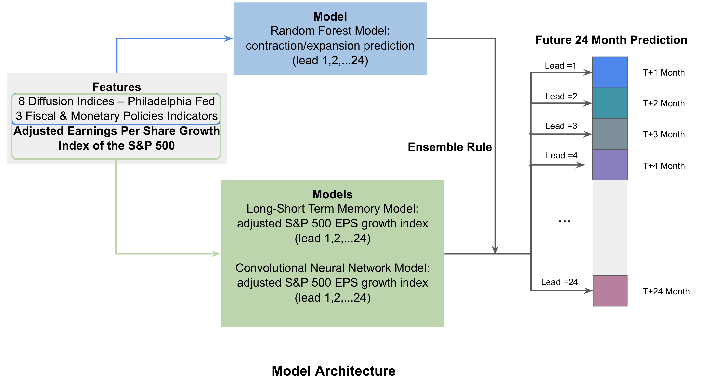

# DSI-KPMG-Capstone: Time Series S&P 500 EPS Index Forecasting Using Sliding Window Based Neural Network
Teams:
Chenxi Di, Liyuan Tang, Nan Tang, Tianqi Lou, Yuxin Qian

Industry Mentors:
Nicholas Abell, Ryan Deming, Sydney Son

Data Science Institute Mentors:
Adam S. Kelleher

## Overview
The Economic Forecasting Capstone project is sponsored by KPMG. Our objective is to make predictions on short-term and long-term financial market behavior using time series data from a set of traditional economic indicators. In the perspective of forecasting, we aim to ensemble multiple models together and use the sliding window approach to forecast an adjusted Earnings Per Share growth index of the S&P 500 (overall market model). In addition, we develop a reusable light-weighted and user-friendly forecasting manual instruction. 

Our data includes monthly multiple economic indicators and adjusted Adjusted Earning Per Share Growth Index of S&P 500 from 1969.08.01 - 2021-03-01. We have also explored the time series pattern for our target variable. The details regarding features and target variable will be discussed in section II and III.

  

Since there is time dependency caused by the effect of previous lags of the predictors on the response, we further create sliding windows in a way such that we could provide our models more comprehensive information. We then deployed three multivariate time series models commonly used in the financial field: VAR models (vector autoregressive models), LSTM (Long Short-Term Memory) Recurrent Neural Network (RNN) and Convolutional Neural Network (CNN). Upon implementing both LSTM Recurrent Neural Network and Convolutional Neural Network, we further introduce a Random Forest model to predict a binary variable indicating where we are on the business cycle (either contraction or expansion period). The model details will be discussed in Section IV. Guided by the business cycle, we develop an ensemble rule which will be discussed in Section V to improve the effectiveness of running both LSTM and CNN together. The ensemble model architecture is shown above.

By incorporating this business cycle information, our ensemble model effectively predicts the financial market turning points. And we achieved accurate and precise predictions during the expansion period. The forecasting result and model evaluation will be discussed in Section VI.

## Target Variable
### Adjusted Earning Per Share Growth Index of S&P 500
We computed Earnings Per Share (EPS) by dividing S&P price by PE ratio, then we  adjusted the EPS based on the August 1969 EPS value(first value in our dataset). 

Earnings Per Share (EPS) = S&P 500 Price / S&P 500 PE Ratio 
Target Variable yt = (EPSt / EPS1969 Aug)*100

Below figure shows the time series trend of our adjusted EPS:

From here, we identified the peaks (green points) and troughs (red points) of our adjusted target variable by searching for local minimum and local maximum. The time series trend has identified several major past economic events including Dot-com bubble (2000-09-01 ~ 2007-06-01) and The Great Recession (2007-06-01 ~ 2012-03-01).

Multiple dashed and solid vertical lines represent distinct business cycles starting from  economic contraction to growth. We categorize each data point into two groups: either in expansion period or contraction period. We assigned labels for each month according to the following criterion: month is within expansion business cycle if it follows after a trough but happens before a peak; month is within contraction business cycle if it follows after a peak but occurs before a trough. Later we use a random forest model to predict where we are on the business cycle. 

## Model Input Explanation
### Feature Selection
Two groups of indicators are selected as input to the model. They are diffusion indices and economic indicators which quantify government policies. The Federal Reserve collects monthly data of activity rate, shipment, unfilled order, input price and employment rates from leading companies of each industry. In economic theories, these indicators have reliable predictive power on forecasting future economic activities.

The above relationship graph shows the potential causal relationship between most of the common economic variables. The direction of the arrow implies that changes in one indicator impacts future changes of another. For example, higher volume of M2 supply will lower effective rate, then relatively higher import price and input price for the manufacturing (PPI). PPI in the end leads to the rise of CPI. We listed these indicators and potential relationships to figure out upper stream indicators that initiate rounds of business cycles. As we can perceive from the graph that Government Balance, 10 Years Treasury Yield (GS10), and M2 supply (cash, credit, saving, checking and certificate deposits) are reasons for changes in other indicators. Therefore, we combine both diffusion indices and indicators of government policy as input features

### Feature Importance
The heatmap visualizes the feature importance of the Random Forest Model. This model performs a binary classification on business cycle (0 for contraction period, 1 for expansion period). The Latter result shows high accuracy and precision of this model, therefore the feature importance reflects how useful the lag of each predictor is in forecasting. 

Laggings of months are listed in vertical direction, and indicators are in horizontal direction. Based on their contribution to prediction accuracy, diffusion indices perform differently from government policy indicators. Short term lags of diffusion indices are useful in forecasting, while long term lags from past one month to two years of government policy indicators are useful in the predication. Among all of the predictors, Employment Rate, Average Work Week, Activity Ratio, Unfilled Orders, GS10 and M2 Supply seem to contribute most to the reliable market growth forecasting. 

## Ensemble Model Compositions
### Rolling Window and Forward Prediction
Now we have a target variable y which is the response of many predictor variables. Furthermore, the response is also correlated with the lags of these feature variables. We wish our model could identify this time dependency. The approach followed by all below models is to reshape the information we have by sliding windows so that we could give more complete information to predict the response variable. Below figure shows how we approach:

Above figure shows that in the case of lag = 3 and lead = 1, the model will map the information contained in the window (values from t-3, t-2, t-1) with the prediction at t. We will slide the window one step at a time and proceed to make predictions. Here, lead = 1 means that we are predicting one month forward (t). 

### Random Forest Model
For future predictions, we wish to incorporate the influence of the business cycle. Therefore, we apply the same rolling window approach on our predictors and utilize them to further implement a random forest model for classifying future business cycles. It operates by constructing a multitude of decision trees at training time and uses the majority votes as the output. Genearly, random forest outperformed decision trees since it corrects for the overfitting to the training set. Random forest can also be used to rank the importance of features and they are computed as the mean and standard deviation of accumulation of the impurity decrease within each tree. 

Below figures shows our random forest model prediction result.

### Convolutional Neural Network Model

The idea behind using the convolutional neural network is to simulate the window of previous values as a ‘picture’. Sliding window presents a matrix of multiple features across time, and CNN is to predict the direction of one time series from the matrix. That is, we are trying to use a parallelism of image recognition to map the pictures to a response value which is the adjusted Earnings Per Share growth index of the S&P 500 in our case. 

As discussed previously, for each feature we consider their past 24 months’ values and apply them into CNN. In the meantime, we set lead = 24, that is, we predict 1,2, ...24 months forward separately and take the average as a prediction. The figure illustration is shown below:

Below figure shows our model structure:

### LSTM Recurrent Neural Network Model

Given that RNN models have short term memories in which the model used previous information for the current neural network. In an LSTM (Long Short-Term Memory) model, the recurrent weight matrix is replaced by an identity function in the carousel and controlled by a series of gates. The input gate, output gate and forget gate acts like a switch that controls the weights and creates the long term memory function. This feature allows us to use the LSTM model to predict time series data based on previous, sequential data and long-term information stored in the model. Similar to CNN, for each feature we consider their past 24 months’ values and apply them into LSTM. In the meantime, we set lead = 24, that is, we predict 1,2, ...24 months forward separately and take the average as a prediction.

Below figure shows our model structure:

## Ensemble Rule

In the pursuit of minimizing prediction errors, we selected two fine-tuned models that give actual numbers. These models can precisely capture the quantitative nature of the target variable. However, this method lacks the ability to predict the future market cycle, which means that the LSTM and CNN model can only predict the actual target variable, but failed to predict the expansion or contraction period of the current business cycle. So it could possibly undermine the accuracy of our prediction. 

To solve this problem, we introduced the Random Forest Model (RFM) to predict the business cycle. Since RFM has very high accuracy (95%), we believe it is a strong feature that we can trust more. Instead of including the RFM results as a feature in the training data, we introduced the Ensemble Rule with supreme influence from RFM to combine the predictions from LSTM and CNN models. In one sentence to describe the rule, the ensemble model selects the result that best conforms with random forest predictions. The Ensemble Rule works as follow:

For example, when the RFM predicts an expansion, we compare the results from LSTM and CNN with the target variable from last month. If both the results from LSTM and CNN are larger than the last target variable, we use the average of LSTM and CNN as the new prediction. Else, we use the maximum value from LSTM, CNN and the last target variable as the new prediction, etc.

By implementing the Ensemble Rule, we are able to predict the context and the target variable at the same time, which helps increase the accuracy of our predictions.

## Model Evaluation

### Backtesting

Backtesting is considered as an important tool in market analysis. Because of the unique features of time series data, and the requirement of data continuity in rolling windows, cross validation reduces the power of model evaluation. We applied two types of backtesting: the first one consists of 24 single tests, each of them tests on performance of a single “lead”, number of months forward; and the second one takes the average of predictions of all “leads” (1 to 24 months forward) for each time stamp. Backtesting takes place on entire historical data. Since our ensemble model outputs predictions for 24 months forward given each sliding window, each time stamp has 24 predicted values, from 24 different sliding windows. This feature makes the second type of backtesting come true. 

We assessed model performance by both R-Square and Rooted Mean Square Error (RMSE). Testing results of each “lead” shows a descending accuracy. The following two plots visualized such relationships. Ensemble model that just predicts 1 month forward (“lead” = 1) outperformed one that predicts 24 months forward (“lead” = 24). 

As we have mentioned before, on each time stamp, 24 different sliding windows made predictions, i.e. lead 1 for the sliding window ended by last month, lead 2 for the sliding window ended by two months ago, and so on. The following plot shows the performance of mean on backtesting. 

The fact that forecasting further months ahead from now boosted variance of prediction explains the phenomenon that “lead” = 1 accurately predicted all the trends of growth and even the turnover points, while “lead” = 24 failed to do so. Predictions based on models with “lead” less than 12 reflected high reliability, since all of the R-squares are higher than 0.95.  

### Baseline Model 

We used the vector autoregression (VAR) model as our baseline model. It is one of the most commonly used multivariate time series regression models. The model evaluates each variable as a linear function of both past lags of itself and that of the other variables. By estimating parameters of these linear functions, VAR is able to predict future values of each variable, which allows it to do a long-term forecast without any further input.

A major assumption of a VAR model is that each input time series should be stationary. Since most variables do not fulfill the requirement, we take differences of the input data to ensure stationarity. The variable M2, which is still not stationary after differencing, is dropped from the input. The lag order of the system is determined using the Akaike information criterion (AIC). Residual autocorrelation and Granger causality are both checked after the VAR model is constructed. 

Since as time goes on, the predicted result of VAR would be based more and more on the values it predicted before rather than the real data we provide when constructing the model. In most cases, the prediction error increases as the length of months to predict increases.

### Model Comparison

We randomly picked two timestamps to forecast the target variable for future 24 months followed by the ensemble rule we mentioned in Part 5. The images below showed the result of our ensemble model and the baseline model. During the expansion period, our ensemble model followed the trend while the baseline model did not. During the turning point in the business cycle, the ensemble model precisely forecasted the turning point while the baseline model did not.

## Future Discussion

We plan to simulate S&P 500 EPS data by resampling or machine learning methods to create more testing and validation sets. Further, we will test for different combinations of embedded models. Due to the time constraint, we will further embed more specific features and therefore finalize a more robust model approach for industry-level forecasting engagements.

## Reference
For future prediction model instruction, please check this [Overall Market Earnings Growth Future Forecasting Instructions](https://github.com/chenxd2/DSI-KPMG-Capstone/blob/main/Overall%20Market%20Earnings%20Growth%20Future%20Forecasting%20Instructions.ipynb)

9 Features from the Philadelphia Fed Survey: 
https://www.philadelphiafed.org/surveys-and-data/community-development-data

Monetary Policy and Fiscal Policy Data:
https://fred.stlouisfed.org/

LSTM Time Series Forecasting: 
https://machinelearningmastery.com/multivariate-time-series-forecasting-lstms-keras/

ML Approaches for Time Series:
https://towardsdatascience.com/ml-approaches-for-time-series-4d44722e48fe

Cycle Detection in Time Series (CyDeTS): 
https://github.com/oemof/cydets

Economic Indicator Definition:
https://www.investopedia.com/terms/e/economic_indicator.asp

Economic Cycle - Overview, Stages, and Importance:
https://corporatefinanceinstitute.com/resources/knowledge/economics/economic-cycle/

Economic Forecasting - Overview and Economic Indicators:
https://corporatefinanceinstitute.com/resources/knowledge/economics/economic-forecasting/

Monetary Policy:
https://corporatefinanceinstitute.com/resources/knowledge/economics/monetary-policy/

